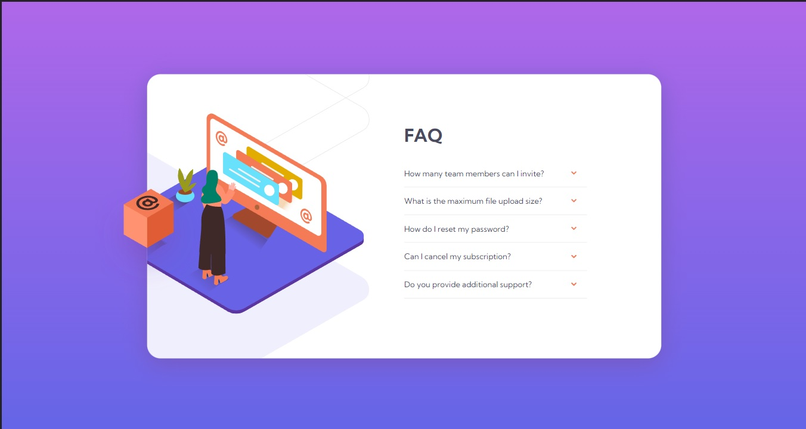
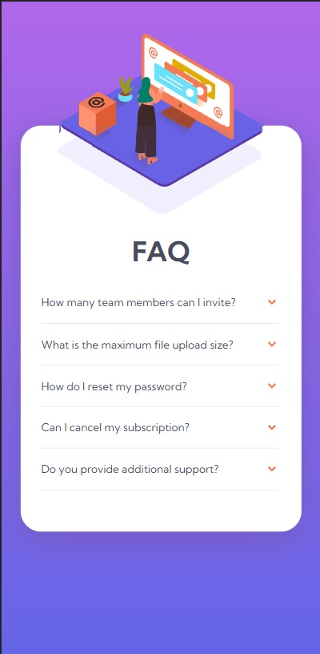

# Frontend Mentor - FAQ accordion card solution

This is a solution to the [FAQ accordion card challenge on Frontend Mentor](https://www.frontendmentor.io/challenges/faq-accordion-card-XlyjD0Oam). Frontend Mentor challenges help you improve your coding skills by building realistic projects.

## Table of contents

- [Overview](#overview)
  - [The challenge](#the-challenge)
  - [Screenshot](#screenshot)
  - [Links](#links)
- [My process](#my-process)
  - [Built with](#built-with)
  - [What I learned](#what-i-learned)
  - [Continued development](#continued-development)
  - [Useful resources](#useful-resources)
- [Author](#author)

## Overview

### The challenge

Users should be able to:

- View the optimal layout for the component depending on their device's screen size
- See hover states for all interactive elements on the page
- Hide/Show the answer to a question when the question is clicked

### Screenshot




### Links

- [Solution URL](https://your-solution-url.com)
- [Live site URL](https://zp021-frontend-mentor-faq-accordion.netlify.app/)

## My process

### Built with

- Semantic HTML5 markup
- CSS custom properties
- Flexbox
- Mobile-first workflow

### What I learned

I learned how to use the details and summary tag for things like frequently asked questions that can be toggled with answers.

To see how you can add code snippets, see below:

```html
<details class="faq">
  <summary class="question">What is the maximum file upload size?</summary>
  <p class="answer">
    No more than 2GB. All files in your account must fit your allotted storage
    space.
  </p>
</details>
```

### Continued development

I wasn't sure about the javascrip part of this challenge, so I'll have to go back and double check that.

### Useful resources

- [Details tag](https://www.w3schools.com/tags/tag_details.asp) - This helped me with the faqs section.

## Author

- Frontend Mentor - [@zp021](https://www.frontendmentor.io/profile/zp021)
- GitHub - [@zp021](https://github.com/zp021)
